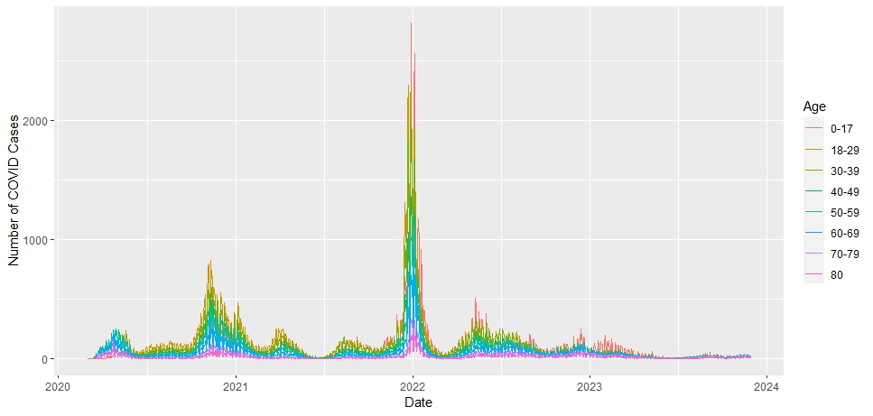

# Final Exam DSCI 101 Fall 2023

```{r, include=FALSE}
library(tidyverse)
library(ggplot2)
library(dplyr)
library(readr)
library(purrr)
chicago_data <- read.csv("chicago_covid_cases.csv")
#view(chicago_data)
```
### NOTE for Dr. Whalen: The graphs for #3, #4, #5 were not showing up in the final, knitted html document even though they were fully printing and compiling in the rmd. For some reason, only the axes were showing up on the html, but the actual graph was blank. As a result, I have attached screenshots of the graphs fully printing in the rmd to show that I did in fact achieve the desired result. The screenshots of the three created graphs should be in the Sakai submission. Running the RMD itself also works. Also, the values for #6 printed in the RMD but returned NA in the html, running the rmd file itself should give you the correcrt values.
## Dataset Description: Chicago COVID Cases

The dataset, named `chicago_covid_cases.csv`, has been sourced from the City of Chicago Data Portal. It represents COVID-19 cases in Chicago and has been cleaned to ensure a standardized format. The dataset includes key variables such as 'date,' 'total' (total cases), 'female,' 'male,' and columns related to different age groups. 

## ONLY WORK WITH YOUR PARTNER ON THE EXAM

**Please write in complete sentences and communicate each answer clearly and succinctly.** 

1. (10pts) Transform the `date` column into a date variable. What are the minimum and maximum dates present in this dataset?

```{r}
chicago_data_var <- chicago_data %>%
  mutate(date = as.Date(date, format = "%m/%d/%Y"))

summary(chicago_data$date)

#The minimum date present is 2020-03-01 and the maximum date present in the dataset is 2023-11-29.
#I am setting the date column to a variable called date after piping into the chicago data and using as.Date to create the variable. I then use summary() to return various statistics abt the variable, including the min and max

```

2. (10pts) Create a new column `year` based on the `date` variable. Determine the average number of cases per year.

```{r}
new_data <- chicago_data %>%
  mutate(date = as.Date(date, format = "%m/%d/%Y")) %>%
  mutate(year = year(date))

# Continue with the processing
avgs <- new_data %>%
  select(year, total) %>%
  group_by(year) %>%
  summarize(mean_total = mean(total, na.rm = TRUE))
print(avgs)

#Needed the as.Date function to ensure that the data in the date column was all in a consistent format. Then I used mutate() to create the new year column based on that new date column with the standardized data (uses lubridate). Then I select the newly created column, organize by it, and print out the summary statistics for the mean of each year. It prints summary of means for "total," organizing by year.

```

3. (15pts) Generate a time series plot for the `total` variable. What insights can you draw from the plot? What context plays into this plot (please write a paragraph).

```{r}
ggplot(chicago_data, aes(x= date, y= total)) +
  geom_line()
#I use ggplot line graph to graph the total column based on the year, with the x-aesthetic being the date and y-aesthetic being the total column data

#The context that plays into this plot is that these are the total covid cases reported for Chicago across the years. Insights from the plot include that the largest spike was in 2022, with the graph seemingly distributed around that spike. In a way the graph is somewhat skewed right because all of the major increases in case-counts were from 2020-2022. Afterward they generally dropped off. There was also a major spike towards the end of 2020, assumably because there was new variants popping up. The deepest dip in total cases was mid-2021, where there was the deepest well in the graph. However, the steepest dip was in 2022, where it went from the largest spike since having measured the data to making one of the quickest wells in the total case count. 2022 probably accounted for such a large spike, comparatively, because of new developments such as vaccine hesitancy and the inception of new variants.
```

4. (20pts) Extract the columns `date`, `female`, and `male`. Calculate the difference between female and male cases and visualize this difference over time. What patterns do you observe? Why might there be more dates with positive differences (more women than men)? Discuss possible explanations, such as higher susceptibility or testing rates among women.

```{r}
chicago_data %>%  
  select(date, female, male) %>%
  mutate(malevfemale_diff = female - male) %>%
  ggplot(aes(x= date, y = malevfemale_diff)) +
  geom_line()
#Using the format of a time series plot again, I selected the appropriate columns, created a new column to sim the difference, and set this new column and the date column as the aesthetics for the ggplot. Geom_line() helped visualize this difference over time.

#The patterns I observed included it being very rare that the difference was negative, meaning that for almost all of the time measured, there were more cases in females than males (because our equation was females - males). Although visually this graph looks somewhat similar to the graph for #3 (same 2022 spike), this is showing that the difference in case count between males and females was largest in 2022. Keeping the #3 graph in mind, there seems to be a correlation between the two graphs: With more cases being counted in total, the disparity between how many female cases there are and how many male cases there are grows wider. It is also important to keep in mind that this graph showing differences is proportional to how many total cases there are. So while there is a huge spike in 2022, there was also one in the previous graph. This may prove that the overall proportion in difference between male cases and female cases are similar, but just that the numbers are larger because there was an overall uptick in cases. There are more dates with positive differences because more women generally contracted covid than men. The graph may infer possible explanations for such a difference between men and women in case count. The graph may infer that women are more susceptible to the pathogen than men are. However, the conclusions the graph depicts may also highlight testing discrepancies, with men [choosing] not being tested as often. 
```

5. (20pts) Recreate this plot.


This will require:
- pivoting
- string cleaning
- proper labeling

```{r}
#Pivoting and string cleaning
chicago_data%>%
  pivot_longer(cols = starts_with("age_"), names_to = "age", values_to = "age_total") %>%
  mutate(age = gsub("age_", "", age),
         age = gsub("_", "-", age)) %>%
  ggplot(aes(x = date, y = age_total, col = age)) +
  geom_line() +
  xlab("Date") +
  ylab("Number of COVID Cases")+
  guides(col= guide_legend(title="Age"))
#I first use pivot_longer to change the code into a long format. I put the age_ column into to different columns, one containing the age groups and the other containing the values associated with them. Then I use mutate and gsub() to clean the strings. I create a a new age column, and use gsub() to remove "age_" and add hyphens for the key. Using ggplot, I map the color to the age column and set the axes to the date and total cases recorded. Using xlab, I set the x-axis label to Date, with the same for the ylab. The guide legend code sets the title for the key.
```

6. (25pts) For all years (2020, 2021, 2022, 2023), perform a bootstrap analysis to estimate the variability in the average number of COVID cases in a year (from `total` per day). What does the standard deviation of the bootstrap averages indicate about the uncertainty in our average estimate (using question 2)? (You may filter each year and do it one by one.) [Note that normally you do not bootstrap on dependent observations but please ignore this assumption for now.]

```{r}
case_avgs <- mean(chicago_data$total)

find_avg <- function(data) {
  return(mean(data, na.rm=TRUE))
}

btstrap_fxn <- function(data) {
  sim_num <- 10000
  btstrap_avgs <- c()
  for(i in 1:sim_num) {
    btstrap_sim <- sample(data, replace = TRUE)
    btstrap_avgs[i] <- find_avg(btstrap_sim)
  }
  sd_avgs <- sd(btstrap_avgs)
  return(sd_avgs)
}

for (year in c(2020, 2021, 2022, 2023)) {
  yearTotal <- chicago_data[chicago_data$year == year, 2]$total
  yearSD <- btstrap_fxn(yearTotal)
  print(paste(year, yearSD))
}

#The SD of the bootstrap averages indicates that the uncertainty in our average estimate is reasonably high. Given the Standard Deviations of the bootstrap averages for each specific year that are returned, we can assume that their is generally high variability. This means that the uncertainty in our average estimate is most likely also very high.

#I first find the mean of the total column and write a mean function that finds the mean based on the inserted vector. Then, i create my bootstrap function to create 25,000 samples that then finds the individual mean for all of them. It stores all of these means in a separate vector and finds the standard deviation across the values. I then have a for loop iterating through all the years and subsets the total column to the yearTotal variable. The for loop applies the bootstrap function to each specific year and its associated mean values. It returns the SD for each year's mean total.
```

Extra Credit: (up to 20pts) Group the data by year, nest the data, and then perform a nested bootstrap analysis to calculate the standard deviation of the bootstrap averages for each year in one pipe of code (may require map/map2/map_dbl/etc)

```{r}
#chicago_data %>%
  #group_by(year) %>%
  #nest() %>%
  #map_dbl(data, btstrap_fxn(btstrap_avgs))
```

